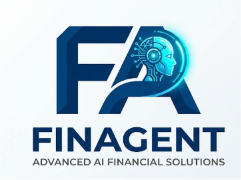

<div align="center">



# FinAgent — B2B KYC & Due Diligence AI

### Premium Forensic Knowledge Graph Investigator with Payment Paywall

[](https://python.org)
[](https://fastapi.tiangolo.com)
[](https://langchain.com)
[](https://neo4j.com)
[](https://openai.com)
[](https://doku.com)

<p align="center">
  <b>The first AI Agent that gates premium forensic analysis behind a real payment paywall.</b><br>
  Upload a corporate document → ask anything → the agent decides your access tier → Neo4j graph extraction → structured KYC report.
</p>

</div>

---

## 📖 Overview

**FinAgent** is an autonomous B2B KYC & Due Diligence AI Agent built on **LangGraph**. It transforms unstructured corporate documents into a forensic **Knowledge Graph** stored in **Neo4j AuraDB**, then lets analysts query it using natural language.

What makes it unique: the agent itself enforces a **monetisation gate**. When it detects a complex investigation requiring deep graph traversal, it pauses the workflow, generates a **real DOKU payment link** (Rp 50,000), and only resumes full Neo4j extraction once payment is confirmed. This is not a frontend trick — the paywall is a **LangGraph node**.

### Key Capabilities

| Capability | Detail |
|---|---|
| **Entity Extraction** | LLM extracts `Company`, `Person`, `Address`, `Document` nodes with roles & properties |
| **Relationship Mapping** | `OWNS_SHARE`, `DIRECTS`, `BORROWS_FROM`, `LENDS_TO`, `REGISTERED_AT`, `TRANSFERRED_TO` |
| **Shell Company Detection** | Flags entities registered in tax-haven jurisdictions |
| **Beneficial Ownership** | Multi-hop graph traversal reveals hidden controllers |
| **Payment Paywall** | Real DOKU sandbox integration — agent pauses mid-workflow for payment |
| **Export Report** | One-click HTML due-diligence report with FinAgent branding |
| **Agent Trace** | Collapsible accordion showing every LangGraph node's output in chat |

---

## 🏗️ System Architecture

```
┌─────────────────────────────────────────────────────────────────┐
│                        User Browser                             │
│   Dashboard (Graph viz) │ Investigasi (Chat) │ Dokumen          │
└──────────────┬──────────────────────────────────────────────────┘
               │ HTTP (Jinja2 + REST)
┌──────────────▼──────────────────────────────────────────────────┐
│                   FastAPI Gateway (port 8000)                   │
│  POST /api/investigate  │  GET /api/result/{id}                 │
│  POST /webhooks/doku-paid  │  GET /api/graph                    │
└──────────────┬──────────────────────────────────────────────────┘
               │ invoke()
┌──────────────▼──────────────────────────────────────────────────┐
│              LangGraph Agentic Workflow                         │
│                                                                 │
│  ┌─────────────────────┐                                        │
│  │  payment_gatekeeper │──[BLOCKED]──► END (return DOKU link)  │
│  └──────────┬──────────┘                                        │
│             │ [PROCEED] (basic free OR deep+PAID)               │
│  ┌──────────▼──────────┐                                        │
│  │      planning       │  LLM decomposes the question           │
│  └──────────┬──────────┘                                        │
│  ┌──────────▼──────────┐                                        │
│  │     write_query     │  LLM generates Cypher query            │
│  └──────────┬──────────┘                                        │
│  ┌──────────▼──────────┐                                        │
│  │      run_query      │  Execute against Neo4j AuraDB          │
│  └──────────┬──────────┘                                        │
│  ┌──────────▼──────────┐                                        │
│  │     answer_user     │  GPT-4o synthesises KYC report         │
│  └──────────┬──────────┘                                        │
│             ▼ END                                               │
└─────────────────────────────────────────────────────────────────┘
               │ read/write
┌──────────────▼──────────────────────────────────────────────────┐
│               Neo4j AuraDB (Cloud Knowledge Graph)             │
│  Nodes: Company │ Person │ Address │ Document                   │
│  Edges: OWNS_SHARE │ DIRECTS │ BORROWS_FROM │ REGISTERED_AT    │
└─────────────────────────────────────────────────────────────────┘
```

---

## 💳 Payment Paywall Flow

```
User asks deep investigation question
         │
         ▼
 LangGraph: payment_gatekeeper node
         │
   depth == "deep"?
   payment_status == "UNPAID"?
         │ YES
         ▼
 DOKU API → create_payment_link()
 Returns: checkout URL + invoice_number
         │
         ▼
 Frontend shows paywall modal
 User pays via DOKU (VA BCA, etc.)
         │
         ▼
 DOKU → POST /webhooks/doku-paid  ← server-side notification
 OR user clicks "GO TO MERCHANT"  ← browser redirect to /payment-success
         │
         ▼
 Session: payment_status = "PAID"
 BackgroundTask: _resume_investigation()
         │
         ▼
 LangGraph re-invoked with PAID state
 → planning → write_query → run_query → answer_user
         │
         ▼
 Chat shows: Agent Trace accordion + full KYC report + Export button
```

---

## 🗂️ Project Structure

```
__FINAGENT/
├── app/
│   ├── api/v1/
│   │   └── endpoints.py        # FastAPI routes, session store, webhooks
│   ├── core/
│   │   ├── config.py           # Settings from env vars
│   │   └── logging.py          # UTF-8 compatible logger
│   ├── services/
│   │   ├── workflow.py         # LangGraph graph + KYCAgentState
│   │   ├── graph_extractor.py  # PDF → LLM → Neo4j entity extraction
│   │   ├── graph_retriever.py  # Natural language → Cypher → answer
│   │   ├── doku_service.py     # DOKU Checkout v1 API integration
│   │   └── llm_service.py      # OpenAI / Groq LLM client
│   ├── static/
│   │   ├── css/style.css       # Dark-theme UI
│   │   ├── js/app.js           # vis.js graph, payment flow, trace accordion
│   │   └── img/logo.png        # FinAgent logo
│   ├── templates/
│   │   └── index.html          # Jinja2 multi-view SPA
│   └── main.py                 # Uvicorn entry point
├── uploads/                    # Uploaded PDF/TXT files
├── sessions.json               # Persisted session state (auto-generated)
├── Dockerfile                  # Production container
├── railway.toml                # Railway deployment config
├── docker-compose.yml          # Local dev stack
├── requirements.txt
└── .env.example                # Environment variable template
```

---

## ⚙️ Tech Stack

| Layer | Technology | Purpose |
|---|---|---|
| **AI Orchestration** | LangGraph | Stateful agentic workflow with conditional edges |
| **LLM** | GPT-4o (OpenAI) | Entity extraction, Cypher generation, report synthesis |
| **LLM Fallback** | Llama-3.3-70B (Groq) | Free fallback when OpenAI unavailable |
| **Knowledge Graph** | Neo4j AuraDB | Cloud graph database for entity relationships |
| **Payment Gateway** | DOKU Checkout v1 | Real sandbox payment with HMAC-SHA256 signature |
| **API Framework** | FastAPI + Jinja2 | REST API + server-rendered frontend |
| **Graph Viz** | vis.js Network | Interactive entity-relationship visualisation |
| **Entity Resolution** | rapidfuzz + jellyfish | Fuzzy deduplication (ICIJ-inspired techniques) |
| **PDF Parsing** | PyMuPDF | Text extraction from corporate documents |

---

## 🚀 Quick Start (Local)

### 1. Prerequisites
- Python 3.10+
- Neo4j AuraDB account (free tier)
- DOKU sandbox account
- OpenAI API key

### 2. Install
```bash
git clone https://github.com/your-username/finagent.git
cd finagent
python -m venv venv
venv\Scripts\activate          # Windows
pip install -r requirements.txt
```

### 3. Configure
```bash
cp .env.example .env
# Edit .env with your actual keys
```

### 4. Run
```bash
python -m uvicorn app.api.v1.endpoints:app --host 0.0.0.0 --port 8000 --reload
```

Open `http://localhost:8000`

---

## 🌐 Deploy to Railway

```bash
# 1. Push to GitHub
git add . && git commit -m "deploy" && git push

# 2. Go to railway.app → New Project → Deploy from GitHub
# 3. Set all env vars from .env.example in Railway Variables tab
# 4. After first deploy, get your URL (e.g. https://finagent-xxxx.up.railway.app)
# 5. Set APP_BASE_URL=https://finagent-xxxx.up.railway.app → Redeploy
```

The `railway.toml` is pre-configured. Railway auto-detects the Dockerfile.

---

## 🔐 Environment Variables

| Variable | Description |
|---|---|
| `DOKU_CLIENT_ID` | DOKU app Client ID |
| `DOKU_SECRET_KEY` | DOKU secret key for HMAC signing |
| `DOKU_BASE_URL` | `https://api-sandbox.doku.com` (sandbox) or `https://api.doku.com` (prod) |
| `NEO4J_URI` | AuraDB connection URI (`neo4j+s://...`) |
| `NEO4J_USERNAME` | AuraDB username |
| `NEO4J_PASSWORD` | AuraDB password |
| `NEO4J_DATABASE` | AuraDB database name |
| `OPENAI_API_KEY` | OpenAI API key (GPT-4o) |
| `GROQ_API_KEY` | Groq API key (fallback LLM) |
| `APP_BASE_URL` | Public URL of deployed app (for DOKU callbacks) |
| `APP_PORT` | Server port (default `8000`) |

---

## 📊 Knowledge Graph Schema

```
(Company)-[:OWNS_SHARE]->(Company)
(Company)-[:BORROWS_FROM]->(Company)
(Company)-[:LENDS_TO]->(Company)
(Company)-[:PAYS_DEBT_TO]->(Company)
(Company)-[:TRANSFERRED_TO]->(Company)
(Company)-[:REGISTERED_AT]->(Address)
(Company)-[:MENTIONED_IN]->(Document)
(Person)-[:DIRECTS]->(Company)
(Person)-[:WORKS_FOR]->(Company)
(Person)-[:MENTIONED_IN]->(Document)
```

---

## 🎯 Built For

**DOKU × AI Hackathon 2026** — demonstrating that AI Agents can embed real payment logic as a first-class reasoning node, not just a UI overlay.

> *"Payment is not a feature bolted on — it's a conditional edge in the LangGraph workflow."*

---

<div align="center">
Made with ❤️ by <strong>Farhan Kamil Hermansyah</strong>
</div>
"# FINGENT_AUTONOMOUS_AI_B2B_KYC_-_DUE_DILIGENCE" 
