# 🕵️‍♂️ GraphWeaver
### AI-Powered Forensic Investigator Agent

  <b>Uncovering hidden connections that traditional search engines miss.</b> 
  Transforming unstructured documents into actionable Knowledge Graphs for Anti-Fraud & Due Diligence.

[View Demo](#-demo-the-blue-ocean-scandal) • [Read Docs](#-documentation) • [Report Bug](https://github.com/Farmil23/graph-weaver/issues)

---

## 📖 Overview

**GraphWeaver** is an autonomous AI agent designed for **Corporate Due Diligence** and **Anti-Fraud Investigation**. Traditional keyword searches often fail to spot complex schemes like money laundering loops or hidden beneficial ownerships.

By combining **Large Language Models (LLM)** with **GraphRAG (Retrieval Augmented Generation)**, GraphWeaver ingests unstructured text (legal docs, news, reports), structures them into a network of entities, and autonomously queries the graph to reveal:

* 🚩 **Conflicts of Interest** (e.g., Officials awarding contracts to family members).
* 💸 **Money Laundering Circles** (e.g., Circular fund transfers).
* 🏢 **Shell Company Networks** (e.g., Entities registered in tax havens with shared addresses).

---

## 🏗️ System Architecture

GraphWeaver operates on a microservices architecture orchestrated by **LangGraph**.

```mermaid
graph TD
    User([User / Client]) -->|HTTP POST /investigate| API[FastAPI Gateway]
    
    subgraph "🕵️ Agentic Workflow (LangGraph)"
        API -->|Dispatch| Supervisor{Supervisor Node}
        Supervisor -->|Task: Parse| Extractor[Llama-3 Extraction Agent]
        Supervisor -->|Task: Query| QueryGen[Cypher Query Generator]
        Supervisor -->|Task: Reason| Analyst[Insight Reasoning Agent]
    end
    
    subgraph "🧠 Knowledge Engine"
        Extractor -->|Write Nodes/Edges| Neo4j[(Neo4j Graph DB)]
        QueryGen -->|Read Context| Neo4j
        Neo4j <-->|Hybrid Search| Vector[Vector Index]
    end

    Analyst -->|Final Report| API


```

